# Cola DLM Figures and Visual Context

All downloaded figures are under:

- Project-page web assets: `docs/reproduction/cola_dlm/figures/project_page/`
- arXiv source figures: `docs/reproduction/cola_dlm/figures/arxiv_source/`

The arXiv source copy preserves original PDF assets. The project-page copy provides browser-friendly PNG/SVG/JPG versions for most main figures.

## Most Important for Architecture

### Overall Workflow

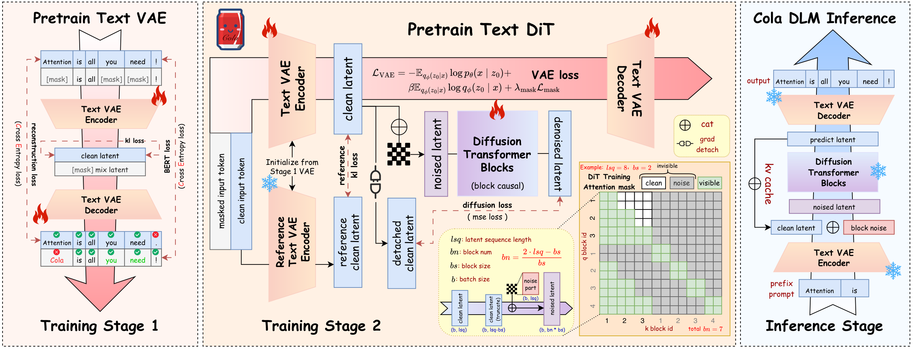

Local paths:

- `figures/project_page/static/images/pipeline.png`
- `figures/arxiv_source/fig/cola_main_fig.pdf`

Use this as the primary architecture reference. It shows:

- Stage 1 Text VAE pretraining with reconstruction, KL/entropy, and BERT-style mask losses.
- Stage 2 trainable Text VAE encoder/decoder plus a frozen reference encoder.
- Reference KL between trainable clean latents and reference clean latents.
- Packed block-causal DiT input construction.
- Clean historical latent conditions are gradient-detached.
- Inference path with prefix encoding, block noise, DiT denoising, KV cache, and decoder output.

### First-Block Conditioning Strategies

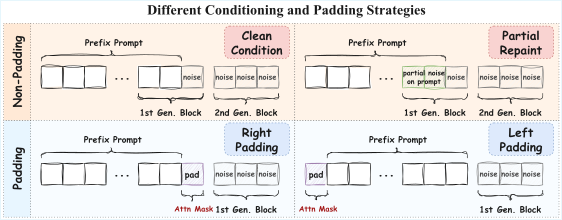

Local paths:

- `figures/project_page/static/images/disc_cond_strategies.svg`
- `figures/arxiv_source/exp_fig/discussion/cond_pad/condition_strategies.pdf`

Implementation relevance:

- The first generated block can mix known prefix latents and unknown response latents.
- Clean condition repaint is the preferred strategy: keep the known region fixed and clean throughout denoising.
- Partial repaint is weaker because it uses noisy/time-varying known-region surrogates.
- Padding strategies are layout-only alternatives and do not match clean conditioning.

### Timestep Shift Sampling

Local path:

- `figures/arxiv_source/exp_fig/rq3/noise_schedule/timestep_sampling.pdf`

Implementation relevance:

- Defines the LogitNormal timestep-shift intuition.
- `loc` moves the sampled timestep regime; `sigma/scale` controls concentration.
- This should map directly to `sample_timestep(config)` in code.

## Main Experimental Figures

### RQ1: Global Semantic Structure

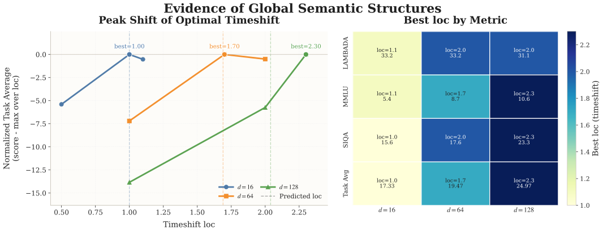

Local paths:

- `figures/project_page/static/images/rq1_global_semantic.svg`
- `figures/arxiv_source/exp_fig/rq1/global_semantic_structure_evidence.pdf`

Takeaway: optimal timestep shift moves upward as latent dimension increases. This supports the claim that latent dimensions share global semantic factors rather than behaving as independent local channels.

### RQ2: Fixed vs Evolving Latent Space

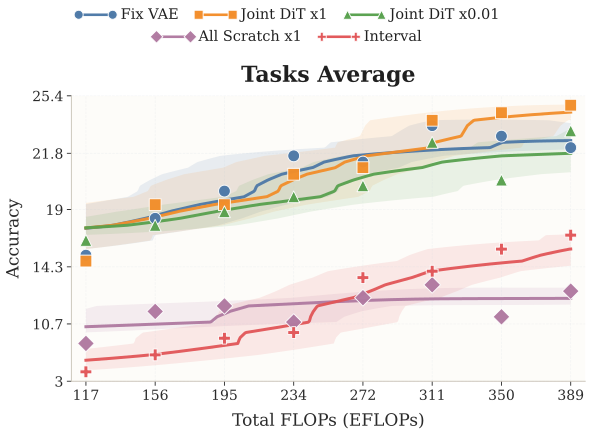

Local paths:

- `figures/project_page/static/images/rq2_fve_tasks_avg.svg`
- `figures/project_page/static/images/rq2_fve_lambada.svg`
- `figures/project_page/static/images/rq2_fve_mmlu.svg`
- `figures/project_page/static/images/rq2_fve_siqa.svg`
- `figures/arxiv_source/exp_fig/rq2/fix_vs_evolve/line/`

Takeaway: the best training strategy is not fixed VAE and not all-scratch. Initialize from a stable VAE, then jointly train VAE and DiT with strong co-adaptation.

### RQ2: Latent-Space Visualization

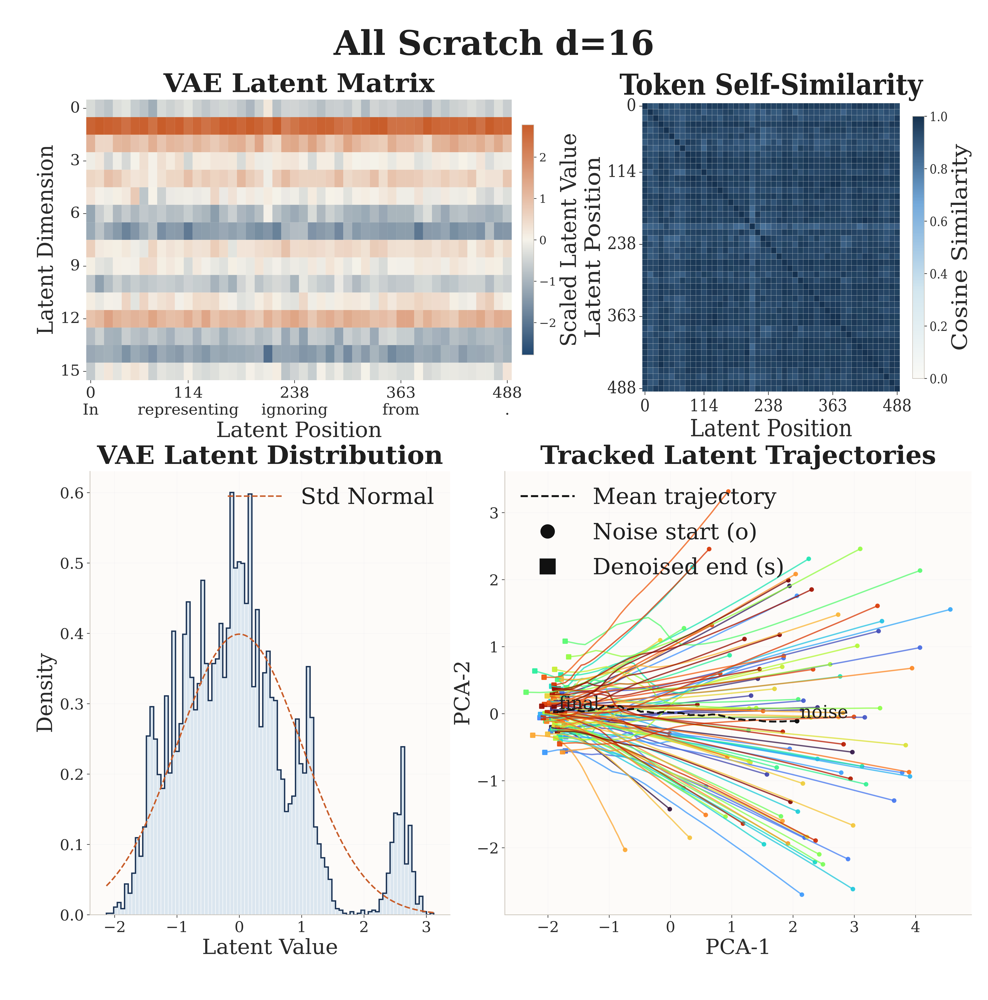
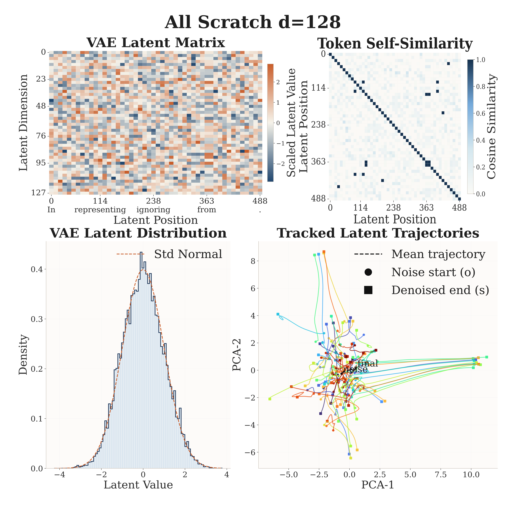
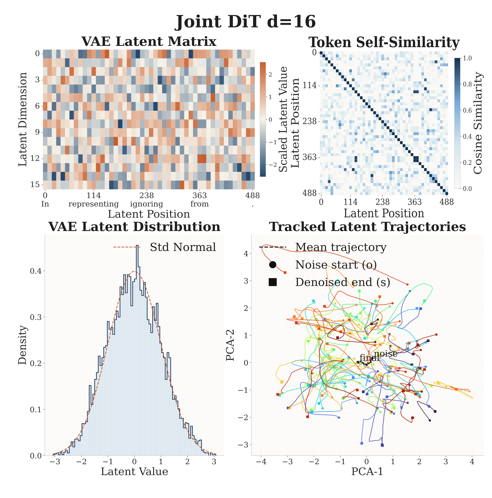

Local paths:

- `figures/project_page/static/images/rq2_vis_all_sc_16.png`
- `figures/project_page/static/images/rq2_vis_all_sc_128.png`
- `figures/project_page/static/images/rq2_vis_dit_sc_16.png`
- `figures/arxiv_source/exp_fig/rq2/fix_vs_evolve/visualize/`

Takeaway: all-scratch training collapses the latent geometry, especially at low dimension. Stable VAE initialization plus joint evolution produces more structured trajectories.

### RQ2: Semantic Mask Loss

Local paths:

- `figures/project_page/static/images/rq2_sem_tasks_avg.svg`
- `figures/project_page/static/images/rq2_sem_lambada.svg`
- `figures/project_page/static/images/rq2_sem_mmlu.svg`
- `figures/project_page/static/images/rq2_sem_siqa.svg`
- `figures/arxiv_source/exp_fig/rq2/semantic/`

Takeaway: BERT-style mask loss improves semantic smoothness, especially when the VAE is actively updated in Stage 2.

### RQ3: DiT Block Size

Local paths:

- `figures/project_page/static/images/rq3_block_30k.svg`
- `figures/project_page/static/images/rq3_block_40k.svg`
- `figures/arxiv_source/exp_fig/rq3/dit_block_size/`

Takeaway: block size 16 is the best reported tradeoff. Block size 1 is competitive but weaker; 64 and 128 degrade performance.

### RQ3: Noise Schedule

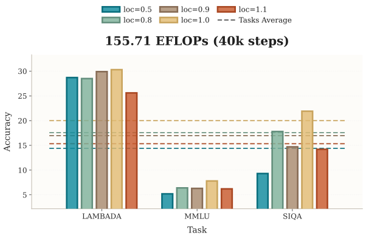

Local paths:

- `figures/project_page/static/images/rq3_ns_bar_40k.svg`
- `figures/project_page/static/images/rq3_ns_tasks_avg.svg`
- `figures/project_page/static/images/rq3_ns_lambada.svg`
- `figures/project_page/static/images/rq3_ns_mmlu.svg`
- `figures/project_page/static/images/rq3_ns_siqa.svg`
- `figures/arxiv_source/exp_fig/rq3/noise_schedule/`

Takeaway: `loc=1.0` is the preferred noise schedule under the paper's main setup.

### RQ3: Inference Steps and CFG

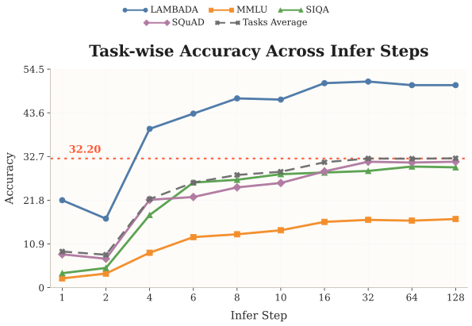
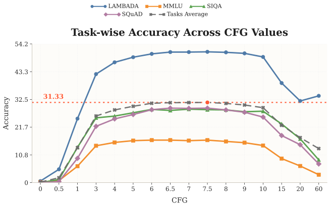

Local paths:

- `figures/project_page/static/images/rq3_inferstep.svg`
- `figures/project_page/static/images/rq3_cfg.svg`
- `figures/arxiv_source/exp_fig/rq3/inferstep/task_vs_inferstep.pdf`
- `figures/arxiv_source/exp_fig/rq3/cfg/task_vs_cfg.pdf`

Takeaway: 8-10 denoising steps recover most gains; 16-32 steps are near saturation. CFG is best at moderate values, and the main comparison uses CFG 7.

### RQ4: Scaling

Local paths:

- `figures/project_page/static/images/rq4_scaling.svg`
- `figures/arxiv_source/exp_fig/rq4/group_tasks.pdf`

Takeaway: under matched about-2B parameter settings, Cola DLM has the strongest late-stage task-average scaling in the reported comparison.

## Discussion and Appendix Figures

### Likelihood vs Generation Gap

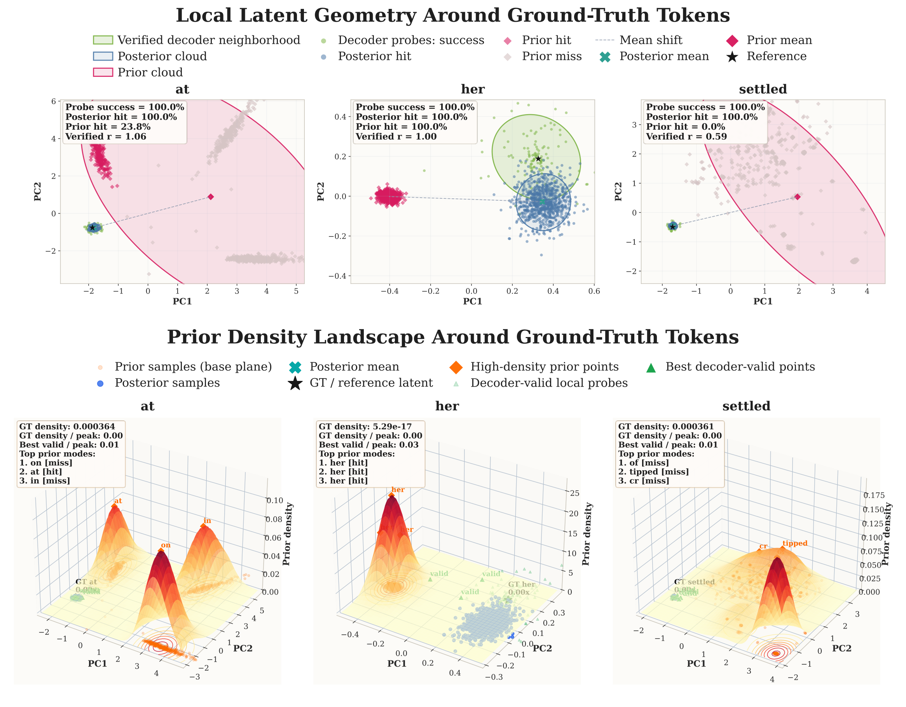

Local paths:

- `figures/project_page/static/images/disc_likelihood.png`
- `figures/arxiv_source/exp_fig/discussion/likelihood/exp_fig_discussion.pdf`

Use this to remember that likelihood/PPL is not the main training-health signal for this architecture.

### VAE Robustness

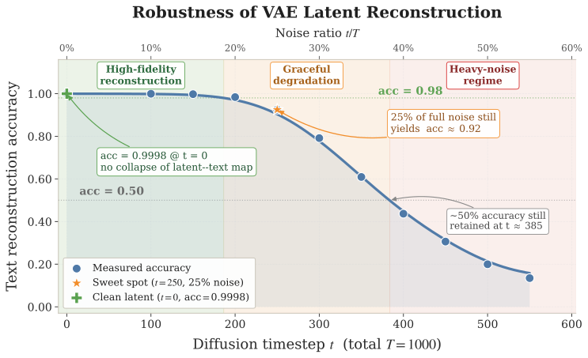

Local paths:

- `figures/project_page/static/images/disc_robust.svg`
- `figures/arxiv_source/exp_fig/discussion/robust/vae_noise_robustness.pdf`

Takeaway: VAE reconstruction stays robust under low/moderate latent noise, supporting the use of VAE latents as the semantic interface.

### Fairness: AR Embedding vs VAE Latent Stability

Local path:

- `figures/arxiv_source/exp_fig/appendix/fairness_embedding_vs_latent.pdf`

Takeaway: the paper argues VAE pretraining mainly stabilizes representation construction and does not replace learning the generative DiT prior.

### Unified Text-Image Extension

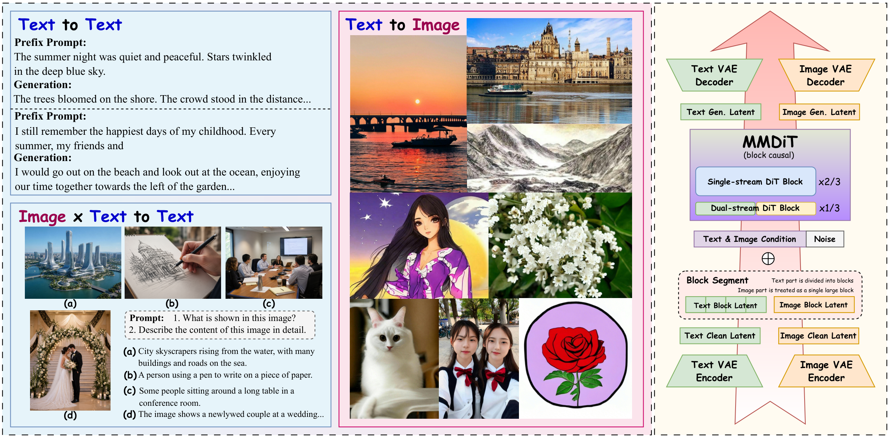

Local paths:

- `figures/project_page/static/images/unified_overview.png`
- `figures/arxiv_source/exp_fig/discussion/unified/unified_samples.pdf`
- `figures/project_page/static/images/unified/`
- `figures/arxiv_source/exp_fig/discussion/unified/`

This is useful background but not required for a text-only Cola DLM reproduction. It shows how text and image latents could share a block-causal MMDiT prior.

## Full Asset Inventory

Project-page image URL list:

- `docs/reproduction/cola_dlm/source_cache/project_image_urls.txt`

Full arXiv source figure tree:

- `docs/reproduction/cola_dlm/figures/arxiv_source/exp_fig/`
- `docs/reproduction/cola_dlm/figures/arxiv_source/fig/`

